# QSupremacy / QArchGauge

QSupremacy is the repository name. The HPCA manuscript presents the framework
as **QArchGauge**: an HPC-driven architecture diagnosis method for
application-level quantum advantage.

QArchGauge pairs a native HPC execution and a quantum-circuit implementation
of the same input. It first checks output quality and complete-loop coverage,
then converts the native runtime into concrete QPU requirements. Perlmutter is
the evidence engine; GPU simulator time is never treated as future QPU time.

- Paper: [`paper/main.pdf`](paper/main.pdf)
- Execution and submission plan: [`plan.md`](plan.md)
- Main evidence manifest:
  [`paper_artifact_manifest.json`](data/processed/perlmutter/paper_artifact_manifest.json)
- Submission audit:
  [`submission_readiness_audit.json`](data/processed/perlmutter/submission_readiness_audit.json)

## What QArchGauge Answers

For each same-record native/circuit pair, QArchGauge reports:

1. whether the circuit output passes the application-quality contract;
2. whether the complete application loop is represented;
3. which QPU resource should improve first;
4. how much improvement is required before the bottleneck changes; and
5. which resource becomes the next architecture target.

The project does not claim current quantum advantage or propose one universal
QPU. It provides workload- and phase-specific targets that can falsify an
architecture proposal before crediting its component-level speedup.

## Final Experiment Status

| Evidence package | Terminal result | Paper use |
| --- | --- | --- |
| Controlled ML/Chem./Opt./Sim. corpus | 3,552 records; 222 structural configurations; 16 seeds per configuration | Main quality and architecture corpus |
| Direct finite-shot closure | 68 source cases x 3 shot counts x 12 replicates | Defines the 12 full-loop eligible Sim. records |
| CIFAR-10 matched ML paths | ResNet-18, Pool-108, and QFeature completed | Deployment-facing ML frontier |
| Chem. and QAOA quality-cost closure | Active-space pair-UCC and direct depth sweeps completed | Quality-recovery cost |
| State-vector capacity | 36/38/40 qubits on 64/128/256 GPUs completed | Capacity only; not application advantage |
| Weak scaling | Completed through 256 GPUs | Evidence-generation throughput |
| Direct strong scaling | Completed at 32/64/128/256 GPUs | Fixed 7,104-record scaling |
| Optional 4/8/16-GPU attempts | `TIMEOUT` after 4,298/5,794/7,092 of 7,104 records | Censored; never plotted as completed runtime |

The failed or canceled precursor jobs were replaced by successful runs where
the paper makes a claim. The final low-GPU attempts are intentionally retained
as timeout-censored artifacts rather than converted into synthetic scaling
points.

## Headline Findings

| Contract | Result |
| --- | --- |
| Noiseless quality | ML 0/2,048; Chem. 48/224; Opt. 0/768; Sim. 256/512 |
| Direct 10k-shot quality | ML 0/4; Chem. 4/8; Opt. 0/24; Sim. 12/32 |
| Full-loop hardware eligibility | Only 12 Sim. records |
| Factory-free logical bound | Median 0.903x native time; 6/12 runtime passes |
| Strict FT contract | Distance 13--15 and 79--86 T states per rotation |
| Strict factory crossover | 2.52--2.75 million parallel factories |
| Relaxed failed-shot sensitivity | 1.53--1.84 million factories, distance 7--9 |
| Joint design transition | T-state supply, then shot lanes, then logical-gate latency |
| Matched LSQCA replacement | No core-area win at 4--7 logical qubits; movement removes all six runtime passes |

## Paper Figure Guide

The following images reproduce every figure included in the manuscript. A
paper figure number is used only when the corresponding figure is present in
`paper/main.pdf`.

### Paper Figure 1 - Measured Evidence Gap

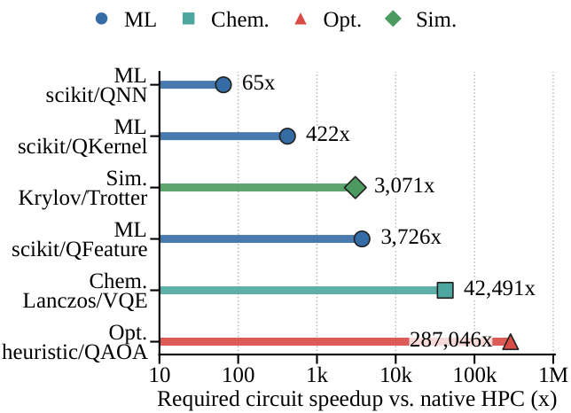

> **Observation 1**
> - Same-input simulator/native gaps range from 65x to 287,046x across the measured paths.
> - QNN, QKernel, and QFeature are distinct ML circuit representations, not peer workload families.
> - These values measure the cost of generating circuit evidence on HPC, not projected QPU runtime.
> - A scalar simulator speedup cannot identify whether quality, shots, gates, factories, or control should improve.

### Paper Figure 2 - Quality-First Inversion

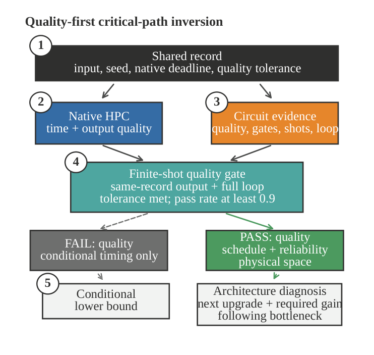

> **Observation 2**
> - Every comparison begins with one shared input, native deadline, and output tolerance.
> - A circuit path that fails quality remains a conditional execution bound and receives no physical target.
> - A passing path must also expose the complete loop, dependency schedule, reliability, and physical space.
> - The final diagnosis reports the next upgrade, required gain, following bottleneck, and maximum component leverage.

### Paper Figure 3 - Perlmutter Evidence Scaling

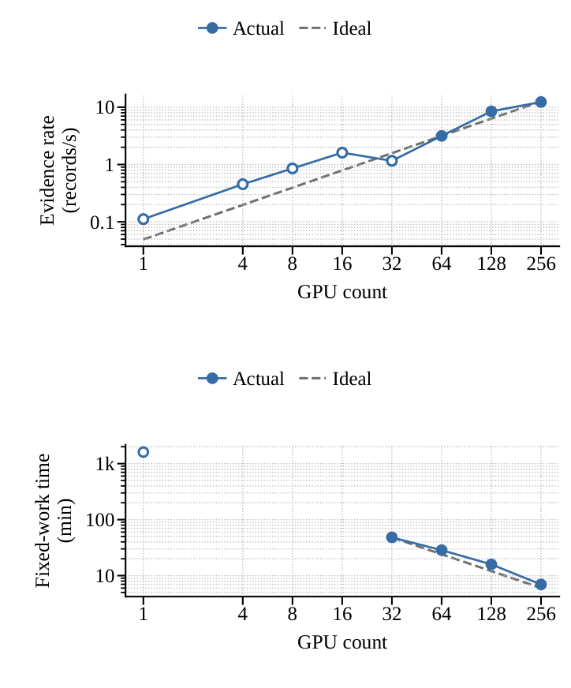

> **Observation 3**
> - Weak scaling reaches 12.3 records/s on 256 GPUs with roughly 28 records per GPU.
> - Completed fixed-work runs reduce 7,104-record time from 2,894 s on 32 GPUs to 418 s on 256 GPUs.
> - The hollow 1-GPU point is a split-array anchor; timeout-censored 4/8/16-GPU attempts are not plotted.
> - This is independent-case evidence throughput, not faster execution of one circuit or QPU scaling.

### Paper Figure 4 - Quality Recovery Cost

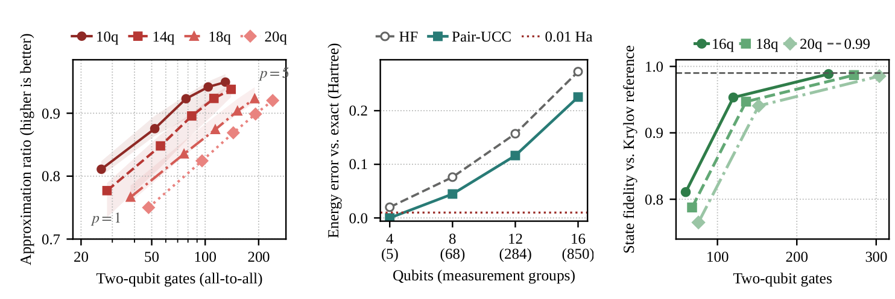

> **Observation 4**
> - Increasing QAOA depth raises median approximation ratio from 0.785 to 0.938 while multiplying two-qubit work.
> - Only the 4-qubit H8 active space reaches 0.01 Ha; measurement groups grow from 5 to 850 with width.
> - Trotter fidelity rises from 0.765 to 0.985 as two-qubit gates grow from 76 to 304.
> - Quality recovery is therefore charged as circuit work rather than assumed to arrive for free.

### Paper Figure 5 - Matched CIFAR-10 Paths

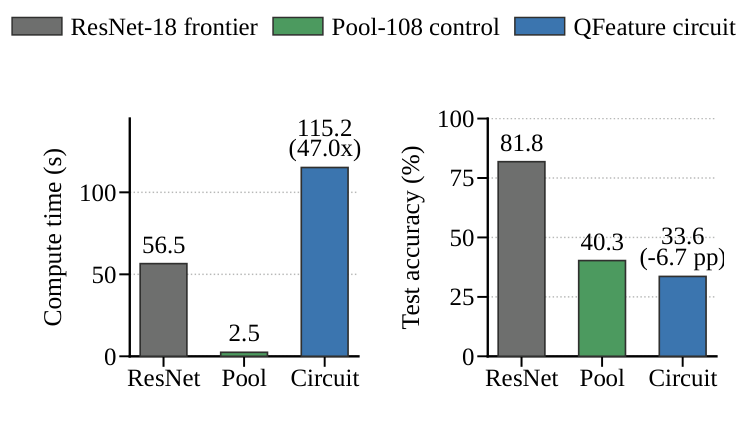

> **Observation 5**
> - ResNet-18 reaches 81.85% accuracy in 56.5 s and defines the deployment-facing quality frontier.
> - Pool-108 reaches 40.28% in 2.45 s using the same feature count and ridge head as QFeature.
> - QFeature reaches 33.60% in 115.16 s, 46.97x slower and 6.68 points below its matched control.
> - Faster logical gates cannot repair this representation-quality gap before QEC or finite-shot costs are added.

### Paper Figure 6 - Adversarial Native Frontier

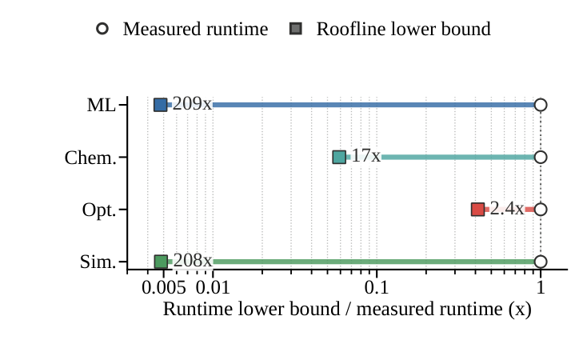

> **Observation 6**
> - A peak/HBM Roofline lower bound shortens ML/Chem./Opt./Sim. native medians by 209x/17x/2.4x/208x.
> - The bound is deliberately unattainable and is not presented as a measured optimized application.
> - Any stronger native implementation moves the quantum break-even boundary outward rather than creating advantage.
> - Later projections keep measured native runtimes, so their hardware requirements remain optimistic against this stress.

### Paper Figure 7 - Quality and Loop Eligibility

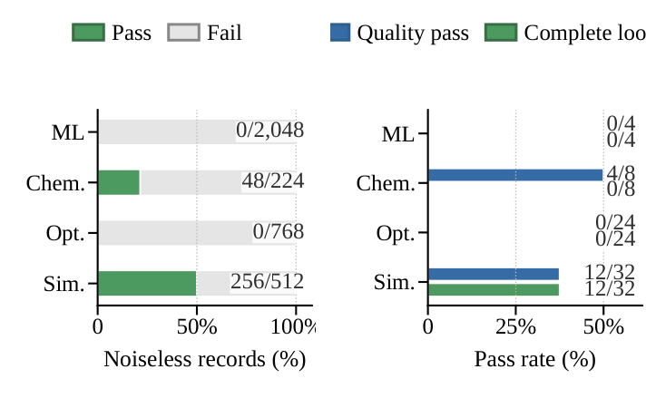

> **Observation 7**
> - The noiseless corpus yields no ML or Opt. passes, 48/224 Chem. passes, and 256/512 Sim. passes.
> - At 10k shots, the direct audit yields 0/4 ML, 4/8 Chem., 0/24 Opt., and 12/32 Sim. quality passes.
> - The Chem. outputs omit the VQE optimizer, while the 12 passing Sim. cases close the same-record loop.
> - Only those 12 Sim. records support physical architecture targets; all other physical timings are conditional.

### Paper Figure 8 - Factory-Free Logical Bound

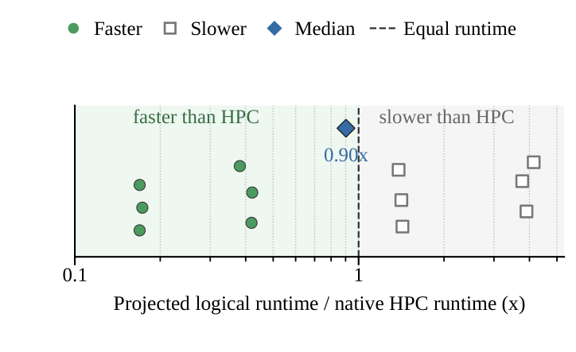

> **Observation 8**
> - Giving the QPU free T-state generation isolates logical gates, direct shots, and host-visible rounds.
> - The 12 eligible records span 0.170--3.891x native time from the 10th to 90th percentile.
> - Median runtime is 0.903x native, but only 6/12 records actually cross runtime parity.
> - Half first need less logical/shot work; the other half expose the physical factory cost next.

### Paper Figure 9 - Reliability-Constrained Physical Target

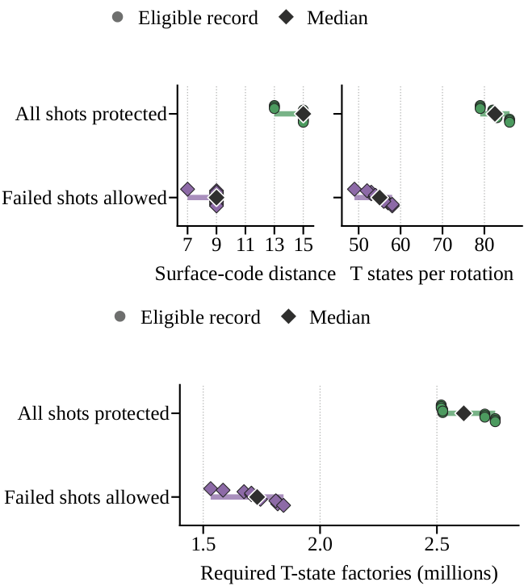

> **Observation 9**
> - Protecting all shots selects surface-code distance 13--15 and 79--86 T states per arbitrary rotation.
> - Allowing a bounded failed-shot tail selects distance 7--9 and 49--58 T states per rotation.
> - The corresponding crossover is 2.52--2.75 million factories under the strict contract and 1.53--1.84 million when relaxed.
> - Reliability changes the magnitude of the physical target but does not change T-state supply as the first bottleneck.

### Paper Figure 10 - Joint Architecture Handoff

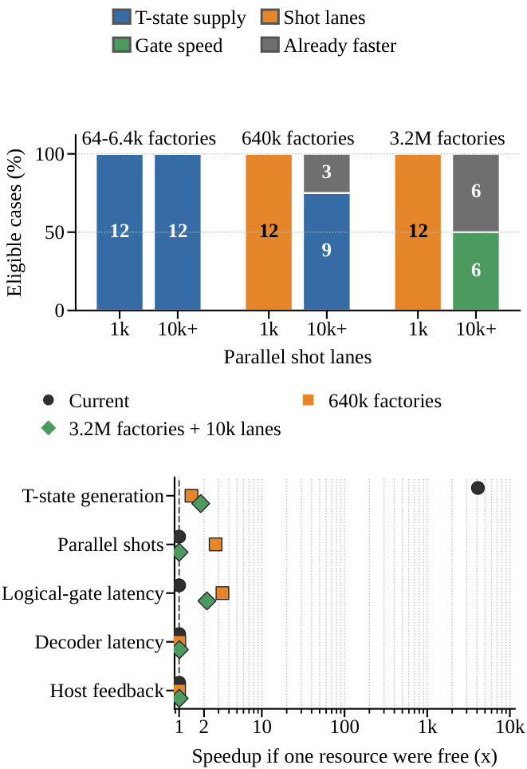

> **Observation 10**
> - T-state supply is the best next 10x upgrade for every eligible record at low factory supply.
> - After factory scaling, insufficient useful lanes expose shot parallelism; sufficient lanes expose gate latency.
> - Making T-state generation free gives 4,102x median gain at the current point, while other free resources give about 1x.
> - The next realizable upgrade and the maximum one-resource gain are different architecture questions.

### Paper Figure 11 - Matched LSQCA Replacement

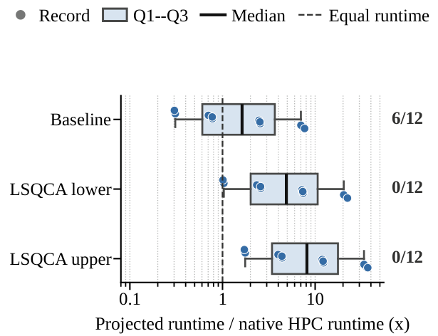

> **Observation 11**
> - The 4--7-logical-qubit records are below LSQCA point-SAM's seven-qubit area crossover.
> - Replacing only matched core and movement events gives no core-area benefit for any of the 12 records.
> - Lower and upper movement envelopes increase median runtime by 3.12x and 5.23x.
> - All six baseline runtime passes disappear, showing why published component averages cannot be universal multipliers.

### Paper Figure 12 - Physical-Modality Pivot

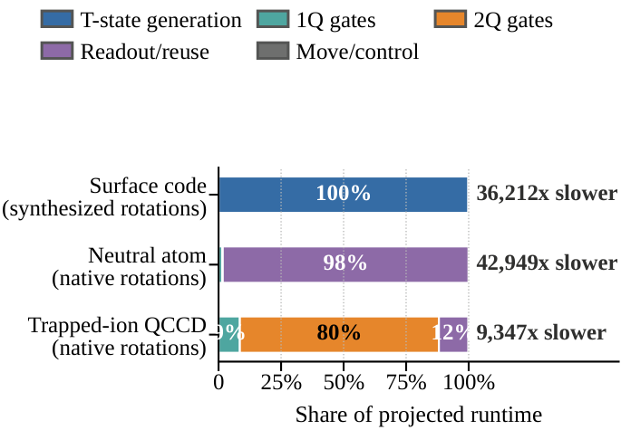

> **Observation 12**
> - The strict synthesized-rotation surface-code envelope remains 36,212x slower than native HPC at the median.
> - Native-rotation neutral-atom and trapped-ion envelopes remain 42,949x and 9,347x slower.
> - Removing distillation shifts time toward readout/reuse or native two-qubit gates rather than guaranteeing advantage.
> - These rows are execution-only counterfactuals, not present-device benchmarks or fault-tolerance claims.

## Supplementary Experiment Figures

These figures are generated from retained artifacts but are not assigned paper
figure numbers. They provide diagnostic detail without expanding the claims in
the manuscript.

### Timeout-Censored Low-GPU Attempts

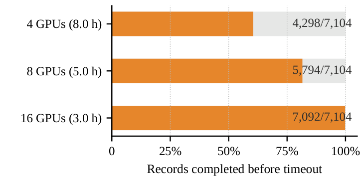

> **Observation**
> - The 4/8/16-GPU jobs completed 4,298/5,794/7,092 of 7,104 records before 8/5/3-hour limits.
> - Slurm records all three allocations as `TIMEOUT`, so none is a valid completed fixed-work measurement.
> - The paper therefore uses only completed 32--256-GPU direct points and the marked 1-GPU split anchor.
> - Partial outputs are preserved for audit but are never interpolated or extrapolated into measured elapsed time.

### Controlled-Corpus Landscape

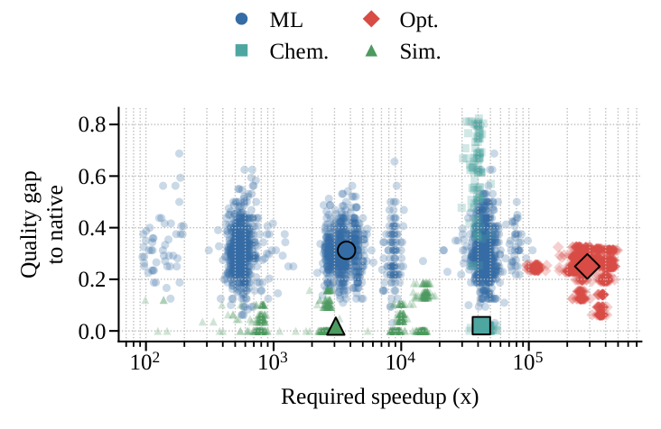

> **Observation**
> - The 3,552-record landscape exposes both required simulator speedup and quality gap to native output.
> - ML, Chem., Opt., and Sim. occupy different regions because their native deadlines and circuit loops differ.
> - Large speedup alone does not imply a hardware target when a record also fails application quality.
> - The dense view is retained for exploration; the paper replaces it with staged quality and architecture gates.

### Digits ML Calibration

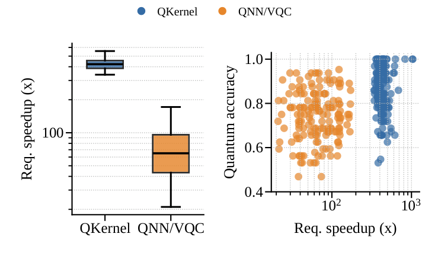

> **Observation**
> - QKernel keeps more classification quality but requires a median speedup of roughly 422x.
> - QNN/VQC has a lower median threshold near 65x but a lower median model accuracy near 0.75.
> - The result separates an expensive kernel-matrix loop from a cheaper but ansatz-sensitive trainable circuit.
> - This calibration motivates treating QKernel and QNN as ML methods rather than separate workload families.

### Scaling Diagnostics

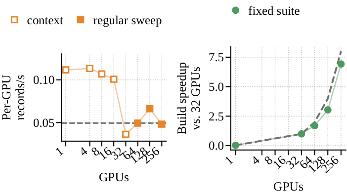

> **Observation**
> - Per-GPU weak-scaling rate is meaningful only when each GPU receives enough independent records.
> - Context runs expose launch and orchestration effects that are hidden by aggregate throughput alone.
> - Fixed-suite build speedup improves through the completed direct ladder and then departs from ideal scaling.
> - These panels diagnose the evidence pipeline and do not model one distributed quantum circuit.

### Sensitivity and Bottleneck Transition

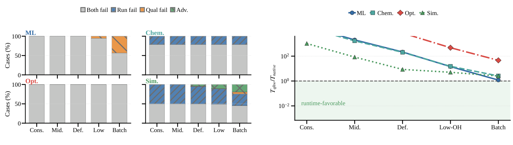

> **Observation**
> - Sensitivity sweeps vary quality recovery, shots, gates, factories, decoder service, and control together.
> - A record enters advantage only when both the quality contract and native runtime boundary are satisfied.
> - Factory improvements eventually expose shot or gate terms instead of producing unbounded end-to-end gain.
> - The paper reports the cleaner eligible-record phase map rather than assigning probabilities to these scenarios.

### Factory-Supply Sensitivity

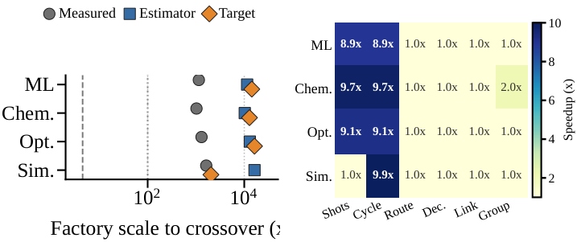

> **Observation**
> - Conditional workload medians require different factory supply because their rotation and repetition demands differ.
> - Removing a dominant rotation term can expose a serial floor that still lies beyond the native deadline.
> - ML, Chem., and Opt. points remain conditional when they fail quality or complete-loop eligibility.
> - The main paper restricts absolute physical targets to the 12 qualified Sim. records.

### Native-Rotation Platform Detail

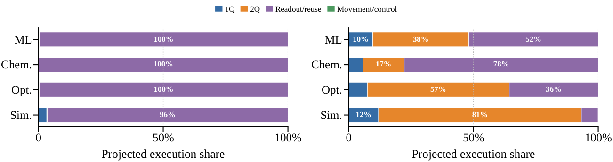

> **Observation**
> - Native analog rotations remove the synthesized T-state term used by the surface-code model.
> - Neutral-atom execution then becomes readout/reuse limited under the calibrated lower-bound attachment.
> - The QCCD envelope is dominated by native two-qubit and routed movement/reconfiguration work.
> - Separate platform panels are retained as sensitivity detail; Paper Figure 12 presents their common comparison.

### Dependency-Aware Feedback Aggregation

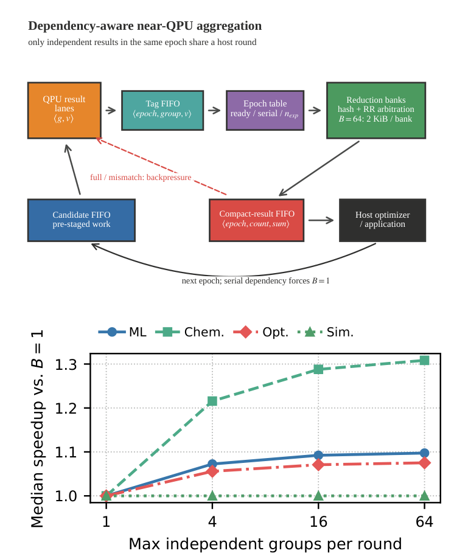

> **Observation**
> - Dependency-ready groups expose parallel work that aggregate gate counts cannot represent.
> - A feedback aggregator can overlap compatible ready groups but cannot bypass the application dependency graph.
> - The ablation gives modest workload-dependent gains and leaves Sim. unchanged when only one group is ready.
> - This design sketch remains supplementary because the paper prioritizes measured first-target and crossover evidence.

### Architecture Focus Matrix

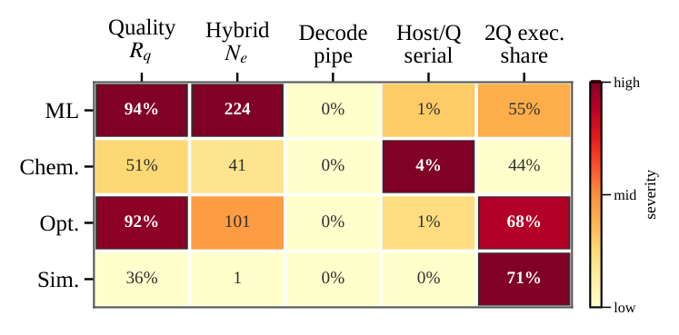

> **Observation**
> - ML and Opt. show dominant quality pressure, while Chem. exposes repeated hybrid evaluation work.
> - Sim. has the cleanest terminal-circuit path but can still be limited by shots and physical execution.
> - The matrix is a descriptive triage view, not a hardware-target eligibility result.
> - The paper replaces this aggregate summary with direct quality gates and eligible-record diagnosis.

### Workload-Coverage Scaling

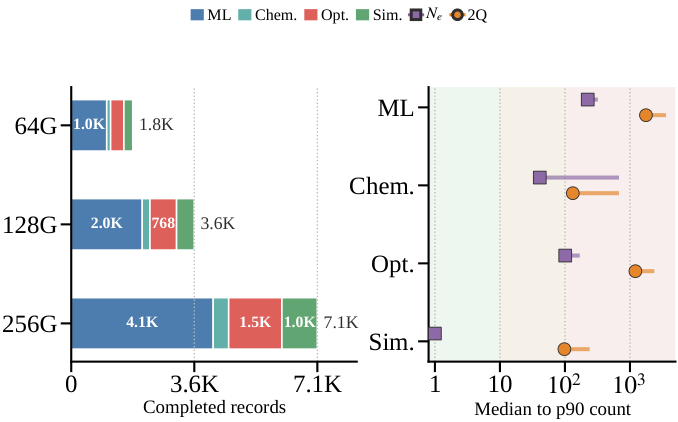

> **Observation**
> - Larger Perlmutter allocations increase completed ML, Chem., Opt., and Sim. evidence records.
> - The distribution also reveals that one raw-record average would be dominated by the larger ML family.
> - Reported headline intervals therefore resample structural configurations and macro-average workload families.
> - Coverage scaling supports statistical evidence generation, not deployment-scale quantum advantage.

## Reproduce the Artifacts

The verified Python environment on Perlmutter is:

```bash
export PYTHON=/pscratch/sd/s/sgkim/kis_cuquantum/00_env/cutn_conda/bin/python
```

Regenerate the evidence audits, figures, and README previews:

```bash
$PYTHON scripts/audit_quality_qualified_targets.py
$PYTHON scripts/audit_dependency_schedule_coverage.py
$PYTHON scripts/audit_statistical_robustness.py
$PYTHON scripts/audit_ft_reliability_budget.py
$PYTHON scripts/run_component_replacement_case_studies.py
$PYTHON scripts/audit_joint_dse.py
$PYTHON scripts/summarize_low_gpu_timeout_runs.py
$PYTHON scripts/generate_paper_figures.py
$PYTHON scripts/render_readme_figures.py
$PYTHON scripts/generate_strong_accept_manifest.py
```

Build and audit the HPCA manuscript:

```bash
source /etc/profile.d/zzz-lmod.sh
module load texlive/2024
make -B -C paper audit
```

The deterministic draft has 14 total PDF pages. The manuscript occupies pages
1--11, references begin on page 12, Figure 4 is the only two-column figure, and
the final submission audit checks legends, Type 3 fonts, minimum figure text,
caption size, anonymous metadata, references, and all 12 GO conditions.

## Authoritative Artifacts

| Evidence | Artifact |
| --- | --- |
| Controlled quality map | `data/processed/perlmutter/quality_qualified_target_map.json` |
| Direct finite-shot quality | `data/processed/perlmutter/finite_shot_quality_sensitivity.json` |
| Dependency schedules | `data/processed/perlmutter/dependency_schedule_coverage.json` |
| Statistical robustness | `data/processed/perlmutter/statistical_robustness.json` |
| FT reliability and space | `data/processed/perlmutter/ft_reliability_and_space_budget.json` |
| Joint phase map | `data/processed/perlmutter/joint_bottleneck_phase_map.json` |
| Matched mechanism replacement | `data/processed/perlmutter/component_replacement_case_studies.json` |
| Native-rotation envelopes | `data/processed/perlmutter/native_rotation_platform_envelopes.json` |
| Low-GPU timeout audit | `data/processed/perlmutter/low_gpu_strong_scaling_timeout_audit.json` |
| Submission manifest | `data/processed/perlmutter/paper_artifact_manifest.json` |
| Paper PDF | `paper/main.pdf` |

Raw measurements remain under `data/raw/perlmutter`; processed JSON/CSV files
record the scope, parameter origin, exclusions, and audit status required to
reconstruct each claim.
